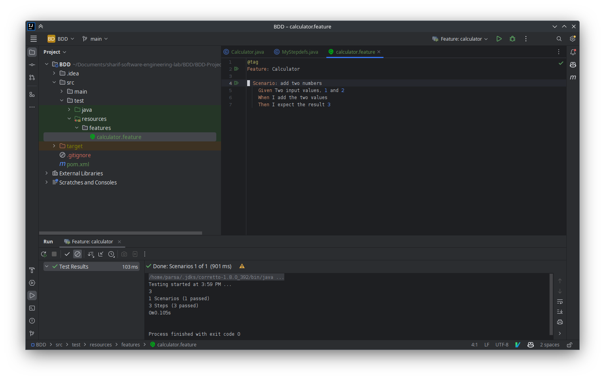

# BDD
Converting Requirments to Test Scenarios Utilizing Behavior-Driven Design

## روال انجام آزمایش

‍1. مراحل مستند به صورت عملی انجام شدند. تصویر انجام آن در ادامه آمده است.

2. در انتهای مستند، هنگام اجرای سناریو اوتلاین، برخی تست‌ها به مشکل آندیفایند برمی‌خورند:

   - این موارد تست‌هایی هستند که دارای عدد منفی‌اند. 
   - در رجکسی که ورودی را تعیین می‌کند، علامت در نظر گرفته نشده است.
   - برای رفع این مشکل، علامت منفی در رجکس اضافه شده است.
    

    